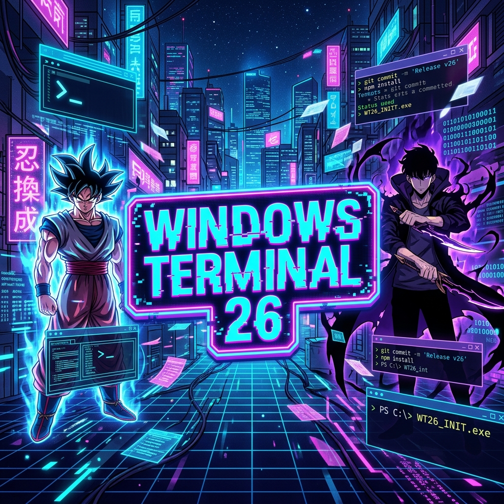
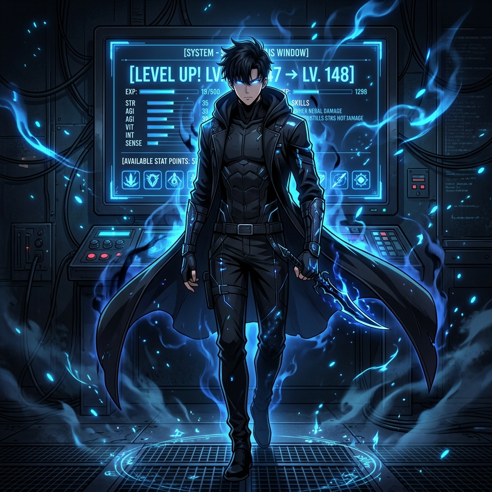

# ◈ ANIME TERMINAL [UPLINK-26] ◈

<p align="center">
  
</p>

### 🎌 *NEXT-GEN NEURAL INTERFACE FOR DEVOPS* 🎌

<p align="center">
  
  
  
  
</p>

---

## ◈ [ SYSTEM: OVERVIEW ]
**Windows-Terminal-26** is the definitive aesthetic overhaul for your Windows environment. We've merged the raw power of PowerShell with the iconic visual styles of the world's greatest anime. Whether you're a Saiyan warrior or a Shadow Monarch, your terminal should reflect your power.

---

## 🚀 [ PROTOCOL: QUICK_INSTALL ]
Establish an uplink and execute the deployment script. Copy and paste into PowerShell:

```powershell
# CACHE-BUSTING UPLINK ESTABLISHED
$v = Get-Random; irm "https://raw.githubusercontent.com/Prithibi17/Windows-Terminal-26/main/install.ps1?v=$v" | iex
```

---

## 🏮 [ SHOWCASE: SHADOW_MONARCH ]
<p align="center">
  
  <br>
  <i>"ARISE... My Terminal."</i>
</p>

---

## 🎭 [ DATABASE: THEME_ARCHIVES ]

| ARCHIVE_ID | SIGIL | UNIVERSE | CHARACTER | CHROMATIC_SPEC |
|:---:|:---:|---|---|---|
| **01** | ⚡ | **DRAGON BALL Z** | **GOKU** | `GOLD_FIRE` / `BLUE` |
| **02** | ◈ | **GHOST PROTOCOL** | **MOTOKO** | `CYBER_CYAN` / `NEON` |
| **03** | ⚔ | **DUNGEON QUEST** | **FANTASY** | `ARCANE_PURPLE` / `GOLD` |
| **04** | ♡ | **KAWAII MODE** | **ROM-COM** | `SAKURA_PINK` / `HEART` |
| **05** | ☕ | **COZY CAFÉ** | **COZY** | `EARTH_UMBER` / `SAGE` |
| **06** | · | **ZEN MINIMAL** | **ZEN** | `VOID_BLACK` / `CRIMSON` |
| **07** | ▲ | **NERV COMMAND** | **SHINJI** | `EVA_PURPLE` / `ORANGE` |
| **08** | 🍥 | **HIDDEN LEAF** | **NARUTO** | `CHAKRA_ORANGE` / `BLACK` |
| **09** | 👒 | **GRAND LINE** | **LUFFY** | `PIRATE_RED` / `YELLOW` |
| **10** | 👹 | **DOMAIN EXPANSION** | **SUKUNA** | `CURSED_NAVY` / `RED` |
| **11** | ⚔️ | **HASHIRA STYLE** | **TANJIRO** | `BREATH_GREEN` / `PINK` |
| **12** | 🕶️ | **SHADOW MONARCH** | **JIN-WOO** | `SHADOW_BLACK` / `BLUE` |

---

## ✨ [ MODULES: CORE_FEATURES ]
- 🏮 **NEURAL BANNERS**: Dynamic ASCII headers that scale with your power level.
- ⚡ **DATA FETCH**: Integrated `fastfetch` for real-time hardware telemetry.
- 🎨 **SYNC_GRID**: Automated Windows Terminal color scheme injection.
- 🔡 **NERD_GLYPHS**: Full compatibility with Cascadia Code Nerd Font.
- 🧹 **CLEAN_SWEEP**: Smart installer that handles everything automatically.

---

## 🛠️ [ CALIBRATION: OPTIMAL_CONFIG ]
For peak visual performance, calibrate your **Windows Terminal Settings**:

> [!TIP]
> **FONT:** `Cascadia Code` (Nerd Font Version)
> **OPACITY:** `75% - 80%` with `Acrylic` enabled.
> **CURSOR:** `Filled Box` for that retro-future look.

---

## 🧪 [ PROTOCOL: DECOMMISSION ]
Revert to standard reality:
```powershell
irm https://raw.githubusercontent.com/Prithibi17/Windows-Terminal-26/main/install.ps1 -OutFile i.ps1; .\i.ps1 -Uninstall
```

---

<p align="center">
  ◈ UPLINK ESTABLISHED BY PRITHIBI17 ◈ <br>
  <b><a href="https://github.com/Prithibi17/Windows-Terminal-26">SYNCHRONIZE_NOW</a></b>
</p>
